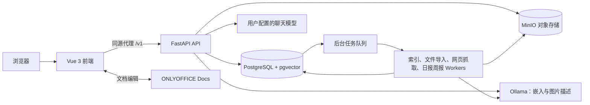

# 基于 AI Agent 的个人知识管理信息系统

一个面向个人使用的知识管理 Web 应用，帮助用户保存和整理笔记、检索积累的资料，并借助 AI 助手理解和复用个人知识。项目采用账号隔离设计，AI 回答可关联笔记来源；分类和分析建议由用户确认后再采纳。

## 功能

- **笔记管理**：创建和编辑 Markdown 笔记，使用笔记本、标签、归档和模板整理内容。
- **混合检索**：结合关键词与向量语义检索，支持查看命中片段并定位原文。
- **多格式资料**：导入 Markdown、DOCX、XLSX、PDF 和图片；提取可检索内容，支持分块上传、续传、版本管理和导出。
- **AI 助手**：基于个人笔记进行引用式问答、笔记分析和分类建议；对话历史按账号保存。
- **网页草稿**：抓取网页内容形成草稿，支持分析、改写建议，并由用户决定是否发布为笔记。
- **知识工作台**：集中查看近期笔记、日程提醒、日报和周报。
- **Office 编辑**：通过 ONLYOFFICE 在线编辑受支持的 Office 与 PDF 文件；图片笔记提供预览和缩放。

## 系统架构



前端通过 FastAPI 提供的业务接口访问数据。PostgreSQL 保存账号、笔记、对话和任务状态；pgvector 保存笔记片段的向量。索引、文件解析、网页抓取和日报/周报由独立 worker 异步处理。文件原件及版本保存在 MinIO，Ollama 提供本地嵌入和图片语义描述能力。聊天模型由用户在应用内配置。

### 技术栈

| 层 | 技术 |
| --- | --- |
| Web 前端 | Vue 3、TypeScript、Vite |
| API 与后台任务 | Python 3.12、FastAPI、SQLAlchemy、Alembic、LangChain |
| 数据库与检索 | PostgreSQL 18、pgvector |
| 文件存储 | MinIO（S3 兼容对象存储） |
| 本地模型 | Ollama、Qwen3 Embedding、Qwen3 VL |
| Office 编辑 | ONLYOFFICE Docs |
| 本地编排 | Docker Compose |

## 快速开始

### 环境要求

- Docker Desktop（或提供 Docker Compose 的 Docker 环境）
- Python 3，用于运行本地启动脚本
- 足够的磁盘空间和网络带宽，用于容器镜像与模型下载

### 启动

在仓库根目录运行：

```bash
python3 scripts/dev-up.py
```

脚本会生成权限受限的 `.env.local`，选择可用端口，并构建、启动本地服务。首次启动时按脚本输出拉取嵌入和图片描述模型：

```bash
docker compose --env-file .env.local --profile model-setup run --rm model-init
```

打开脚本输出的本地入口，注册账号即可开始使用。AI 对话、分析和分类建议需要在应用设置中配置聊天模型连接。API 文档可通过本地入口的 `/docs` 访问。

### 常用命令

```bash
# 查看服务状态
docker compose --env-file .env.local ps

# 查看主要服务日志
docker compose --env-file .env.local logs --tail=100 api db ollama web

# 停止服务并保留数据卷
docker compose --env-file .env.local down

# 按锁文件安装前端依赖并构建（含类型检查）
cd web && npm ci && npm run build
```

`.env.local` 包含数据库、对象存储凭据和模型连接加密密钥，不要提交或公开。停止服务时不要添加 `-v`，否则 Docker 会删除笔记数据库、模型和文件对象存储卷。更多初始化、验证和部署说明见[开发与验收说明](docs/DEVELOPMENT_AND_ACCEPTANCE.md)及[云端部署说明](docs/DEPLOYMENT_CLOUD.md)。

## 项目结构

```text
api/
  app/
    auth/         账号认证与会话
    assistant/    AI 助手、对话、日报周报与调用链
    core/         数据模型、数据库、对象存储与共享基础设施
    knowledge/    笔记、文件导入、索引、检索、提醒与工作台
    ops/          后台 workers、健康检查和运维功能
  alembic/        数据库迁移
  scripts/        验证、维护和评测脚本
web/src/          Vue 页面和组件
docs/             架构、接口、数据库、开发与验收文档
deploy/           生产部署示例与脚本
```

## 文档

- [架构与阶段边界](docs/ARCHITECTURE.md)
- [开发与验收说明](docs/DEVELOPMENT_AND_ACCEPTANCE.md)
- [功能清单与阶段对照](docs/FEATURE_INVENTORY_2026-10.md)
- [API 接口设计](docs/API_DESIGN.md)
- [数据库设计](docs/DB_DESIGN.md) · [数据库字段字典](docs/DATABASE_DICTIONARY.md)
- [M2 接口与数据设计](docs/M2_DESIGN.md) · [M3 多格式笔记设计](docs/M3_DESIGN.md)
- [云端演示部署](docs/DEPLOYMENT_CLOUD.md)
